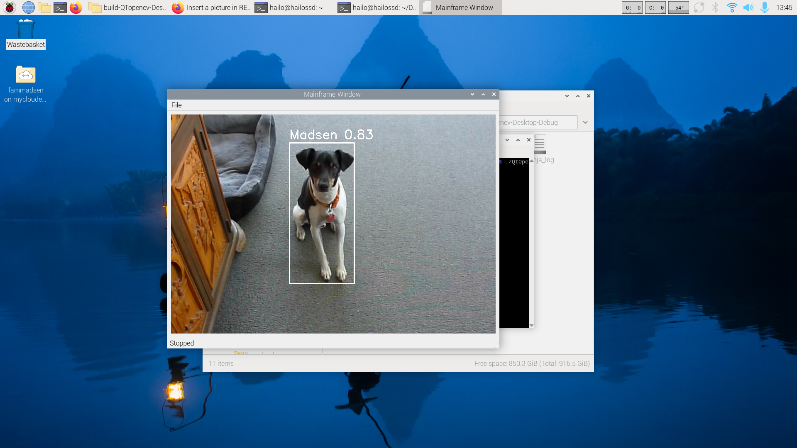
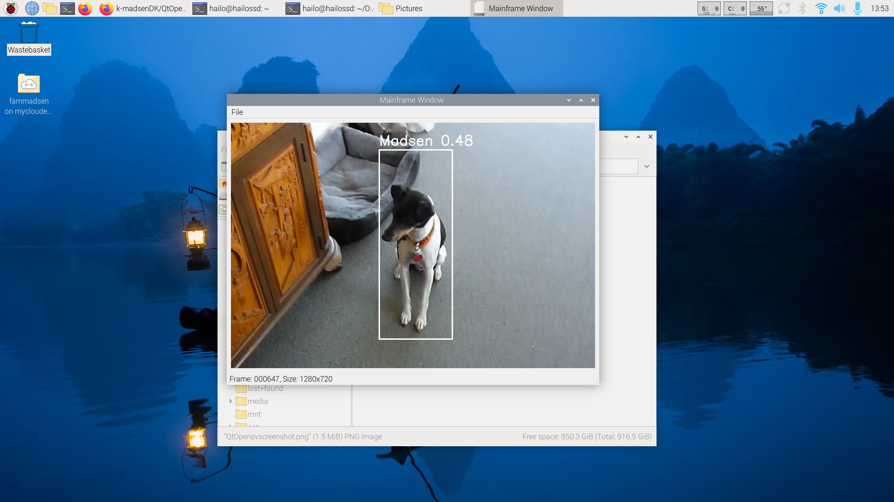

# Simple Program for Saving Frames from MP4 Videos Using Hailo Detection

This program lets you watch an MP4 video, see detection results from a Hailo-generated text file, and save frames as JPG images if you need them. It’s designed to work with a Hailo+ hat on a Raspberry Pi.

## How to Use

- Press the **spacebar** to start or stop the video.
- Use the **left arrow key** to go back one frame (slow).
- Use the **right arrow key** to go forward one frame.
- Press **Ctrl+S** to save the current frame as `filename+framenumber.jpg`.
- The bottom slider makes it easy to go forward and backward to the file (added 12-07-25)
- **CompareWidget**: CompareWidget allows you to open a dedicated comparison window for side-by-side or table-based frame comparison. Launch it from the main window to compare multiple frames or images interactively.
  
## Preparing Detection Files

- You need to use `madsen.py` to generate the detection text file, not `detection.py`.
- To create this text file, run:
- python3 basic_pipelines/madsen.py --hef-path resources/yolo11s.hef --input example.mp4 >> example.txt
- Make sure the text file has the same name as the MP4 file, just with a different extension.
- 
- There’s also `yolo_detect_madsen.py` for making a text file from a YOLO file (for testing a new compilation before making a new HEF compilation). You must have `ultralytics` installed. If you need help, ask Copilot for an installation guide.
- python3 yolo_detect_madsen.py --model=best.pt --source=test.mp4 >>test.txt
- the `yolo_onnx_detect_madsen.py` is equ `yolo_detect_madsen.py` but it is for testing difference between model.pt and the exported model.onnx
- python3 yolo_onnx_detect_madsen.py --model=best.pt --source=test.mp4 >>onnxtest.txt
 
- CompareWidge is designet to compare the textoutput from to diferent hef builds
- python3 basic_pipelines/madsen.py --hef-path resources/build1.hef --input example.mp4 >> build1.txt
- python3 basic_pipelines/madsen.py --hef-path resources/build2.hef --input example.mp4 >> build2.txt
- use comparewidget to see the difference on the hef model builds on the same video
  
## Tips

- Start the QtOpencv program in the folder where you want your saved pictures.
- Use this program to help improve your model: watch an MP4 of the objects in your model, and if the detection score is low or missing, save some frames and add them to your model’s pictures folder.

## Screenshots




## Notes
- The best result using phone cammera is 9:16 ratio.
- Sometimes, if you take pictures with your phone, they might be upside down. In these cases, the bounding box might be in the wrong place, but the saved picture will still be in the right orientation.
- `madsenhave.txt` is a text file that explains more.
- UPS comparewidget was missing in CmakeList.txt sry.
- this is only working until relaese  april-2025 sry:-(  
## To Build

Run:
```
cmake .
```
